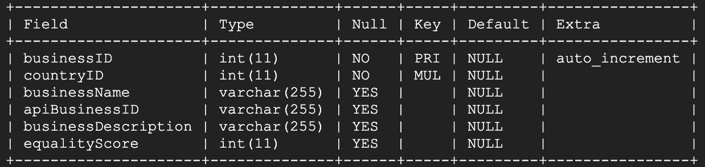
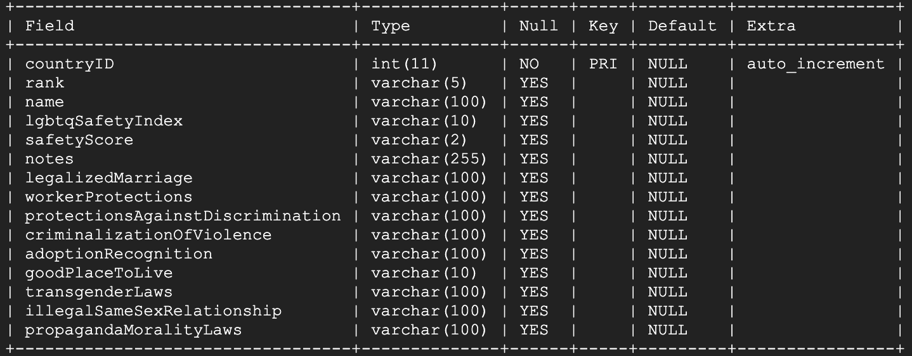

## Setting up our Database
1. Access Google Cloud Platform
2. Navigate to SQL from the drop down menu
3. Create a new SQL instance
4. Select Users and add as necessary
5. Select Databases and Create Database

## Accessing our Database
1. Access Google Cloud Platform
2. Open Cloud Shell
3. Access the GCP database:
    - `gcloud sql connect <database instance> --user=root --quiet`
    - Enter password (if password was set when creating the database)
4. Select the project’s database 
    - `USE <database name>;`

## Using Files to Populate Database
### Add file to GCP
1. Under Cloud Storage, select **cse403-sp22-travelo-hey.appspot.com**
2. Click in **UPLOAD FILES**
3. Choose the file(s) you want to upload (.csv/.txt)

### Insert File Information into Database
1. Under SQL, click on **gcp-travelo-hey**
2. Select **IMPORT** 
3. Under Source, click on **BROWSE** to look for the uploaded file
4. Select cse403-sp22-travelo-hey.appspot.com > your file
5. Click on **SELECT**
6. If you have uploaded a .csv or .txt file select the CSV option
7. Choose the database 
8. Insert the exact name of the table you want to insert the data
9. Click on **IMPORT**

To confirm that the database contains the data imported, access the database using the steps under “Accessing our Database” section.

## Useful MySQL Commands
|**MySQL Command**    | **Description**                                     |
|:-------------------:|:---------------------------------------------------:|
|SHOW TABLES\;        |Display list of the tables available in the database |
|DESC \<table name\> \;  |Display table’s schema                               |

## Database Schema
Our database is composed of a total of 4 tables with the following names: businesses, countries, reviews and users. Below are their schemas.

#### Businesses

#### Countries

#### Users

#### Reviews

