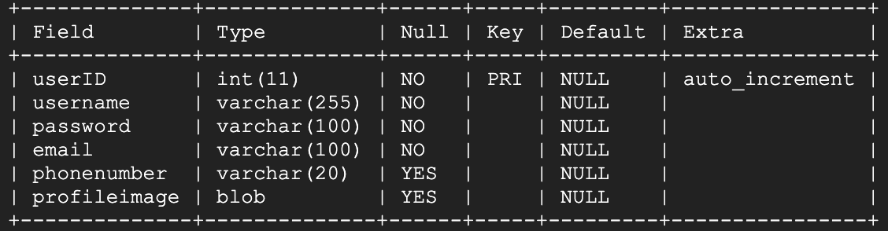
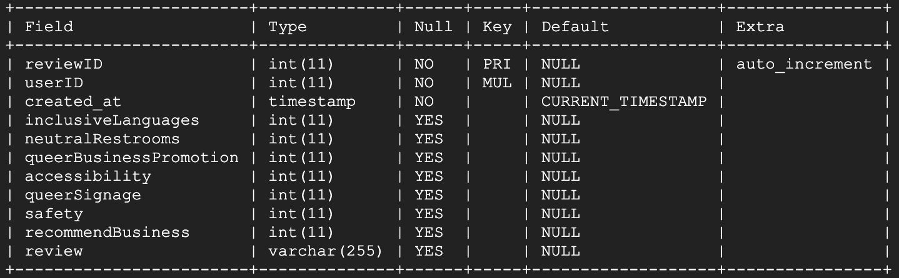

# Database

## Contents

- [Database Connection](#Database-Connection)
- [Calling the Database](#Calling-the-Database)
- [Retrieve Data from Table](#Retrieve-Data-from-Table)
- [Close Database-Call](#Close-Database-Call)
- [Database Schema](#Database-Schema)
    

For this project, we are utiliing a local sqlite database that contains three tables:
- **users** - contains user login information
- **countries** - contains Asher and Lyric Country Ranks
- **reviews** - contains the business review created by a user

### Database Connection
The database connection can be found in `server/db_connection`.

### Calling the Database
To instantiate a call to the database:

```js
    // Promisse
    const db = require('../db_connection');

    async function f_name() {
        const response = await db.getDBConnection();
    }
```


### Retrieve Data from Table
In order to check the contents of a datable inside the travelo-hey.db, use the following:

```js
    const query = `<add query here>`;
    const row  = await response.all(query, []);
```

### Close Database
After utilizing the call to database, we must close the connetion:

```js
    await response.close();
```

### Useful MySQL Commands
|**MySQL Command**    | **Description**                                     |
|:-------------------:|:---------------------------------------------------:|
|SHOW TABLES\;        |Display list of the tables available in the database |
|.schema              |Display table’s schema                               |
|CREATE TABLE         |Creates a new table                                  |
|SELECT               |Select an entry from a table                         |
|INSERT               |Insert a new entry in the table                      |

### Database Schema

##### Countries


##### Users


##### Reviews
