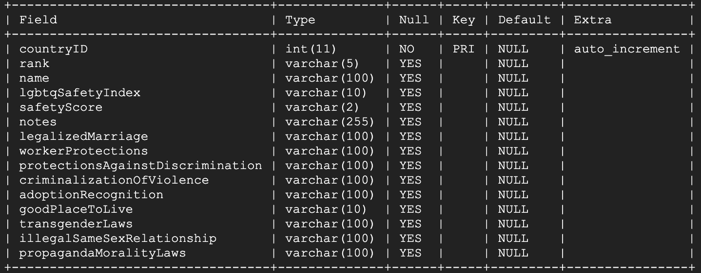

# Set up Instructions

## Table of Contents
- [Back-end](#Back-end)
  -  [Setting up a Domain Name Service](#Setting-up-a-Domain-Name-Service)
  -  [Pre-requisites](#Pre-requisites)
  -  [Migrate Project to GCP](#Migrate-Project-to-GCP)
  -  [Set up Build Config File (yaml)](#Set-up-Build-Config-File-(yaml))
  -  [Use Cloud Build](#Use-Cloud-Build)
  -  [Setup Google App Engine](#Setup-Google-App-Engine)
  -  [Deploying Website](#Deploying-Website)
  -  [Updating the Code](#Updating-the-Code)
- [Database](#Database)
  - [Setting up our Database](#Setting-up-our-Database)
  - [Accessing our Database](#Accessing-our-Database)
  - [Using Files to Populate Database](#Using-Files-to-Populate-Database)
  - [Useful MySQL Commands](#Useful-MySQL-Commands)
  - [Database Schema](#Database-Schema)

## Back-end
### Setting up a Domain Name Service

Usually, you will want to register a domain name for your site. You can use a public domain name registrar, such as [Google Domains](https://domains.google.com/about/), 
to register a unique name for your site. If you want complete control of your own [domain name system (DNS)](https://wikipedia.org/wiki/Domain_Name_System), you can use [Cloud DNS](https://cloud.google.com/dns) to
serve as your DNS provider. The Cloud DNS documentation [includes a quickstart](https://cloud.google.com/dns/quickstart) to get you going.

### Pre-requisites
- Create a GCP project
- Have the project on Github
- Enable Cloud Build API
- Enable Cloud App Engine API

### Migrate Project to GCP
1. Go to the search windows and enter "Repository"
2. Click on Source Repositories.
3. Click on **Get started** and **Create repository**.
4. Then, select **Connect external repository**.
5. Under Git provider choose Github and click on Connect to GitHub.
Next a dialog window will open where you'll need to log into GitHub (if you're not already) and then confirm the connection between Google 
Cloud and GitHub. When the connection is made, a window with your GitHub repositories will appear. Choose the one you'd like to connect with 
your Google Cloud project.
6. Click on the **Connect selected repository** button.
A new page with your Google Cloud repository will open. It will have the code from GitHub in it.

### Set up Build Config File (yaml)
-

### Use Cloud Build
1. Open your [Cloud Build Triggers page](https://console.cloud.google.com/cloud-build/triggers)
2. Choose your project if it had not been chosen
3. Click **+Create Trigger** button
4. These are the following fields that you have to fill

**Name:** the name of the trigger. You can name it whatever you want, but because I am creating a trigger when I push to master, I’m naming it 
`“push-master-branch”`

**Event:** there are three kinds of events that you can choose: Push to a branch, Push a new tag, and Pull request (although only for GitHub). 
Since I am creating a trigger when I am pushing a commit, I choose “Push to a branch”

**Source:** if you have chosen “Push to a branch” in the event, it will show **Repository** and **Branch** option. Since I have added the repository, 
I can choose it in the dropdown. Also, this is where you can choose which branch push will trigger the build. All the branches that you have 
pushed to Github will be shown in the dropdown. In this case, I choose **“^master$”**.

**Build configuration**: there should be nothing that you need to change. But to make sure, check if the input is like the following.

### Setup Google App Engine
Because Cloud Build will build the repository to an App Engine application, we should create it first.
1. Go to [App Engine tab](https://console.cloud.google.com/appengine) in your GCP console
2. Click Create Application button
3. Choose your Region
4. Click Create App button
5. You will be asked the Language and Environment options which are optional. Choose “Node.js” for the Language options so you will be given Node.js documentation links for App Engine in the next page.

### Deploying Website
- Using Cloud Shell:
  1. Open the Cloud Shell (look for it in the search bar)
  2. A terminal window will appear (in the bottom of the screen). Enter:
```gcloud app deploy app.yaml```
  3. When it asks you "Do you want to continue?" enter: Y

- Using App Engine:
  1. Download Cloud SDK and follow instructions in the GCP page

### Updating the Code
Whenever the code is updated, do the following:
1. Upload the code to GitHub
2. Deploy the code to GAE using this command: 
```gcloud app deploy app.yaml```

## Database

### Setting up our Database
1. Access Google Cloud Platform
2. Navigate to SQL from the drop down menu
3. Create a new SQL instance
4. Select Users and add as necessary
5. Select Databases and Create Database

### Accessing our Database
1. Access Google Cloud Platform
2. Open Cloud Shell
3. Access the GCP database:
    - `gcloud sql connect <database instance> --user=root --quiet`
    - Enter password (if password was set when creating the database)
4. Select the project’s database 
    - `USE <database name>;`

### Using Files to Populate Database
#### Add file to GCP
1. Under Cloud Storage, select **cse403-sp22-travelo-hey.appspot.com**
2. Click in **UPLOAD FILES**
3. Choose the file(s) you want to upload (.csv/.txt)

#### Insert File Information into Database
1. Under SQL, click on **gcp-travelo-hey**
2. Select **IMPORT** 
3. Under Source, click on **BROWSE** to look for the uploaded file
4. Select cse403-sp22-travelo-hey.appspot.com > your file
5. Click on **SELECT**
6. If you have uploaded a .csv or .txt file select the CSV option
7. Choose the database 
8. Insert the exact name of the table you want to insert the data
9. Click on **IMPORT**

To confirm that the database contains the data imported, access the database using the steps under “Accessing our Database” section.

### Useful MySQL Commands
|**MySQL Command**    | **Description**                                     |
|:-------------------:|:---------------------------------------------------:|
|SHOW TABLES\;        |Display list of the tables available in the database |
|DESC \<table name\> \;  |Display table’s schema                               |

### Database Schema
Our database is composed of a total of 4 tables with the following names: businesses, countries, reviews and users. Below are their schemas.

##### Businesses


##### Countries


##### Users


##### Reviews


[Back to Top](#Set-up-Instructions)
